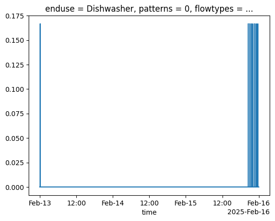

# Discharge common methods

## Start time sampling protection

Start times for consumption events are sampled from a probability distribution informed by the enduse statistics included in the enduse config files. Start and duration of events are tracked for each enduse with a protection applied against sampling a `start_time` that falls into the usage time of a previously sampled consumption event for that enduse.

## Spillover

An enduse consumption event can extend past midnight. If this occurs on the final day of the simulation, the remainder of the consumption event past midnight is incomplete.

The `spillover` feature allows the user to optionally flag if they would like this consumption event to be looped back into the start of the first day of the simulation. The rationale for this is that modellers value diurnal patterns and often wish to preserve antecedent conditions in profiles.

To summarise the possible scenarios:
- Single day simulation: Optional flag to run `spillover` resulting in consumption flows past midnight being looped to start of the day. Default is to cutoff past midnight.
- Multiple day simulation: Consumption events continue into the next day. Optional flag to run `spillover` only applies to the final day in the simulation which loop it into the first day of the simulation.

Spillover can be enabled during simulation of a `house` by enabling the `spillover=True` argument such as: `house.simulate(spillover=True)`. Currently, `spillover` functionality is only enabled for the `WashingMachine` and `Dishwasher` enduses.

The plot below shows an example 

<figure>

<figcaption>Plot of consumption for Dishwasher enduse over three day period with spillover enabled.</figcaption>
</figure>