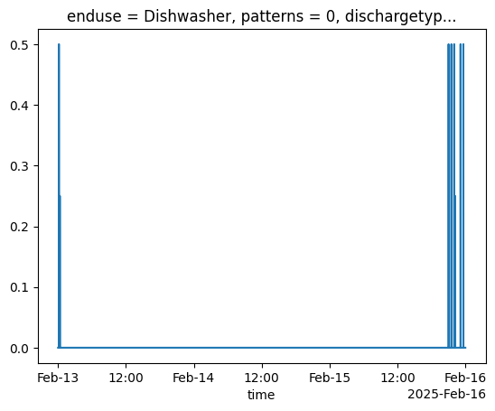

# Discharge common methods

## Limit discharge rate

In most cases, an enduse discharge flow rate is sampled from a unifrom distribution (low and high defined in configs). In a simple case, e.g. `BathroomTap`, if a discharge flow rate is sampled that is higher than the sampled consumption rate, the discharge flow rate will be limited to the consumption flow rate. You can't have water discharging from the system faster than it enters.

## Offset simultaneous discharge

A water consumption event for an enduse may begin soon enough after a previous consumption event that the water associated with that event may not have completely discharged. A protection is implemented that checks if water is being discharged at the current timestamp. If water is still being discharged, the new discharge event will be shifted to begin at the next timstamp without a discharge flow rate. This ensures the correct total volume of water is discharged - think of this as a sink being used again before it has finished draining therefore adding more water to the sink and increasing the time it takes to drain.

## Spillover

This functions in the same way as a [spillover consumption event](https://pysimdeum.readthedocs.io/en/latest/consumption/common_methods/#spillover). An enduse discharge event can extend past midnight. If this occurs on the final day of the simulation, the remainder of the discharge event past midnight is incomplete.

The `spillover` feature allows the user to optionally flag if they would like this discharge event to be looped back into the start of the first day of the simulation. The rationale for this is that modellers value diurnal patterns and often wish to preserve antecedent conditions in profiles.

To summarise the possible scenarios:
- Single day simulation: Optional flag to run `spillover` resulting in discharge flows past midnight being looped to start of the day. Default is to cutoff past midnight.
- Multiple day simulation: Discharge events continue into the next day. Optional flag to run `spillover` only applies to the final day in the simulation which loop it into the first day of the simulation.

Spillover can be enabled during simulation of a `house` by enabling the `spillover=True` argument such as: `house.simulate(spillover=True)`. Currently, `spillover` functionality is only enabled for the `WashingMachine` and `Dishwasher` enduses.

The plot below shows an example 

<figure>

<figcaption>Plot of discharge for Dishwasher enduse over three day period with spillover enabled.</figcaption>
</figure>