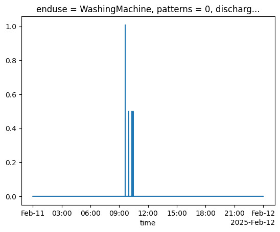

# Discharge enduse

The methodologies for calculating consumption flows for a sampled enduse event are detailed below.


## Bathroom Tap

The `BathroomTap` is the enduse with the most simple discharge simulation. It is assumed that water begins discharging immediately when a consumption event begins. The total volume of water consumed and duration of consumption event informs the duration of the discharge event given a sampled discharge flow rate.

## Bathub

The `Bathtub` follows a similarly simple discharge to the `BathroomTap` with one exception. A `usage_delay` is sampled from a unifrom distribution defined in the config file. This represents the duration a user will spend in the bath before then discharging the bath water.

## Shower

## Wc

The `Wc` is the only enduse that discharges prior to water consumption. As per other enduses, the discharge simulation is still linked to the consumption simulation. The volume of water consumed is the same as that which is discharged. The start time of the consumption event is used as the end of the discharge event.

## Kitchen Tap

## Outside Tap

Discharge for the `OutsideTap` is set as 0 and assumed to discharge into the ground rather than a sewer network.

## Washing Machine

The `WashingMachine` and `Dishwasher` are two appliances included in `pysimdeum` that have cycles of water discharge (and consumption) during a single operation. A washing machine will repeatedly intake and discharge water a number of times over a single usage event. This is represented within the discharge event for this enduse.

In the config file `WashingMachine.toml`, an `enduse_pattern_input` section is specificed that details the full `runtime` of usage event (in this case 7200 seconds). The water consumption `cycle_times` are defined as the time periods of water intake at a flow rate `intensity`. Discharge events occur in the gaps between water intake cycles and are set to finish in the timestep before the following intake cycle. The flow rate is calculated based on configured `discharge_time` specified within the config file. The final discharge event takes place 1/3 through the remaining time after the end of the final intake cycle and the full runtime, leaving time for a spin cycle.

```yaml
[enduse_pattern_input]
    intensity = 0.1667
    runtime = 7200
    cycle_times = [
        {start = 0, end = 121},
        {start = 3600, end = 3660},
        {start = 4920, end = 4980},
        {start = 6120, end = 6180}
    ]
```

<figure>

<figcaption>Plot of discharge for WashingMachine enduse demonstrating mutiple water intake cycles.</figcaption>
</figure>

## Dishwasher

The `Dishwasher` uses the same methods as detailed above for the `WashingMachine` to simulate enduse discharge. Enduse statistics for the `Dishwasher` are provided in the config file `Dishwasher.toml`. Formatting is very similar such as the inclusion of `cycle_times`, but will have slightly different input values to the `Dishwasher`.