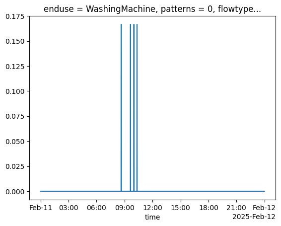

# Discharge enduse

The methodologies for calculating consumption flows for a sampled enduse event are detailed below.

## Bathroom Tap

## Bathub

## Kitchen Tap

## Outside Tap

## Shower

## Washing Machine

The `WashingMachine` and `Dishwasher` are two appliances included in `pysimdeum` that have cycles of water consumption (and dishcharge) during a single operation. A washing machine will repeatedly intake and discharge water a number of times over a single usage event. This is represented within the consumption event for this enduse.

In the config file `WashingMachine.toml`, an `enduse_patter_input` section is specificed that details the full `runtime` of usage event (in this case 7200 seconds). The water consumption `cycle_times` are defined as the time periods of water intake at a flow rate `intensity`. Notice the gap between the end of the final water intake cycle at 6180 seconds and the total runtime of 7200 seconds. This is to provide time for water discharge and other functions such as a spin cycle.

```yaml
[enduse_pattern_input]
    intensity = 0.1667
    runtime = 7200
    cycle_times = [
        {start = 0, end = 121},
        {start = 3600, end = 3660},
        {start = 4920, end = 4980},
        {start = 6120, end = 6180}
    ]
```

Daily pattern data is specified in the config file as `daily_pattern_input` in hourly intervals, and interpolated into the specified resolution (1s) for the day. A start time is sampled using this probability distribution. Then the enduse consumption cycles are input to the consumption object. Below is a plot of simulated consumption for a single use of a `WashingMachine` on a single day.

<figure>

<figcaption>Plot of consumption for WashingMachine enduse demonstrating mutiple water intake cycles.</figcaption>
</figure>

## Dishwasher

The `Dishwasher` uses the same methods as detailed above for the `WashingMachine` to simulate enduse consumption. Enduse statistics for the `Dishwasher` are provided in the config file `Dishwasher.toml`. Formatting is very similar such as the inclusion of `cycle_times`, but will have slightly different input values to the `WashingMachine`.